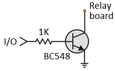
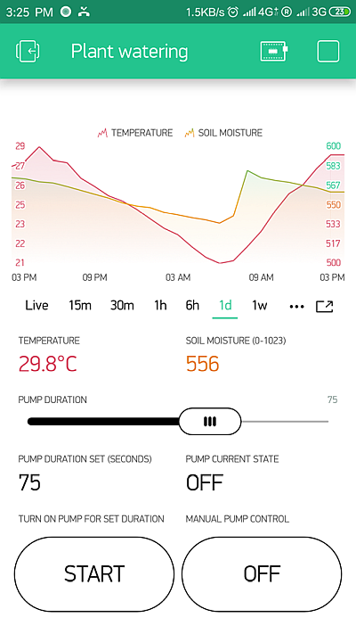
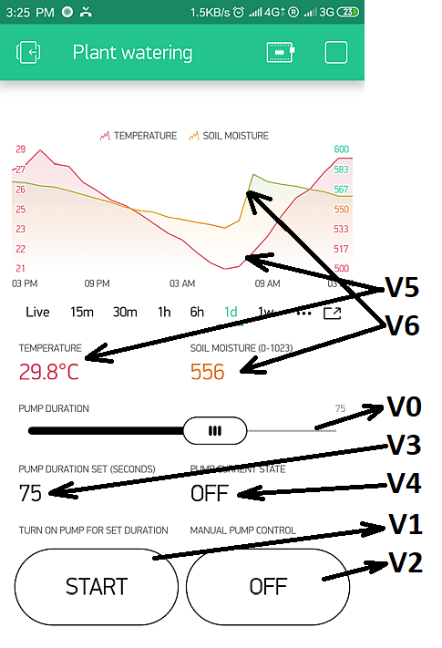

# Plant Watering with ESP8266 and Blynk App
This project was created to fill in the gap we had while going for holidays: Our flowers and plants needed to be watered and I was too busy to create a complex system.
I decided to uyse the simplicity of Blynk as it requires low to almost no need of messing up with code and hardware.  
Apart from controlling the pump, I also added a temperature sensor and a soil moisture sensor.

## What you will need:
   - 1x NodeMCU or similar ESP8266 unit with access to at least 2 I/O
   - 1x Relay board *(to control the water pump)*
   - 1x DS18S20 1-Wire digital thermometer *(I used the ones soldered already on a long cable)*
   - 1x Soil moisture sensor *(analog, with 3 pins)*
   - 1x Mini water pump *(12V)*
   - 2x Power supply *(5V USB for the NodeMCU + 12V for the water pump)*
   - *OPTIONAL:* 1x Voltage regulator module *(in case you just want to use a 12V power supply and generate the 5V from it)*

**NOTE:**  You may need an additional transistor (BC548  for example) and an additional 1k resistor if your relay has inverted 5V logic, following the schematic:  


## Requirements for programming your ESP8266:
   - [Arduino IDE](https://www.arduino.cc/en/Main/Software)
   - [ESP8266 Board manager](https://randomnerdtutorials.com/how-to-install-esp8266-board-arduino-ide/)
   - [Blynk library](http://help.blynk.cc/en/articles/512105-how-to-install-blynk-library-for-arduino)
   - Blynk account on your phone and an Authentication Token for your project
   
## Configuring your ESP8266:
### Configuring your WiFi network:
Open the project file and edit your WiFi credentials on the following lines:
```C++
char ssid[] = "supersecretwifi";
char pass[] = "supersecretpassword";
```

### Configuring your Blynk Auth Token:
Create a new project from your Blynk App and register the ESP8266 as a new device, place the Auth Token you get on the following line:
```C++
char auth[] = "auth-token";
```

### Configuring your sensors:
Comment out the lines refering to a sensor that you will **NOT** be using:
```C++
#define USE_TEMP_SENSOR                         // Comment this out if you are not using a 1-Wire temperature sensor (DS18B20)
#define USE_SOIL_MOISTURE_SENSOR                // Comment this out if you are not using an analog (3 wire) soil moisture sensor
```

### Configuring your ESP8266 physical pins:
Configure on the following lines the physical pins where you have your pump, temperature and soil sensor power pin. The soil sensor is analog and should be connected to the AN0 pin of the ESP8266  
**NOTE:** You must add an appropriate resistor divider to limit the voltage from 0-1V as the ESP8266 only accepts 1V maximum. if you are using a NodeMCU the resistor divider is usually included on the board
```C++
#define PUMP_PIN                        4       // Physical pin where you connected the pump relay/driver
#define PUMP_LOGIC_INVERTED             false   // Select true if the pump turns ON when the output is low (0V)
#define TEMP_SENSOR_PIN                 14      // Physical pin where you connected the 1-Wire temperature sensor
#define MOISTURE_SENSOR_POWER_PIN       5       // Physical ping where you connect the soil moisture sensor power (+) pin. Analog is connected to AN0
```

### Configuring your Blynk virtual pins:
Configure your virtual pins to be used on the Blynk App. You should later set the appropriate pins related to these ones:
```C++
#define BLYNK_APP_PUMPTIMERVALUE_VPIN   V0      // Pump timer value (in seconds) tied to a slider (values: from 1 to a reasonable number like 600)
#define BLYNK_APP_PUMPONTIMER_VPIN      V1      // Push button to turn pump ON for the timer value above (values: 0 or 1)
#define BLYNK_APP_PUMPONOFF_VPIN        V2      // ON/OFF button (or timer/scheduler) to turn pump ON/OFF manually (values: 0 or 1)
#define BLYNK_APP_PUMPTIMERSTATUS_VPIN  V3      // Status (duration set) of the pump timer (in seconds): (values: from 1 to a reasonable number)
#define BLYNK_APP_PUMPSTATUS_VPIN       V4      // Status of the pump every time its status changes (values: "OFF" or "ON"). In the app the reading frequency should be set to PUSH
#define BLYNK_APP_TEMP_VPIN             V5      // Value for temperature sensor. In the app the reading frequency should be set to PUSH
#define BLYNK_APP_SOILMOISTURE_VPIN     V6      // Value for the soil humidity. In the app the reading frequency should be set to PUSH
```

## Configuring your Blynk project:
You may configure your Blynk project according to your needs. This is how mine looks like:  


Here are the virtual pins assigned to the elements of the project. The arrows show which direction the data flows:  

